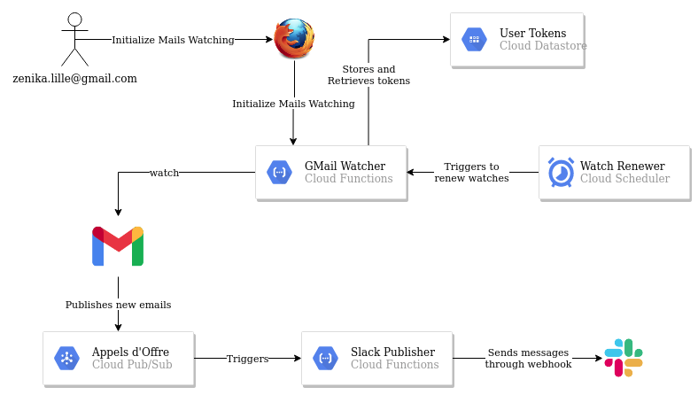
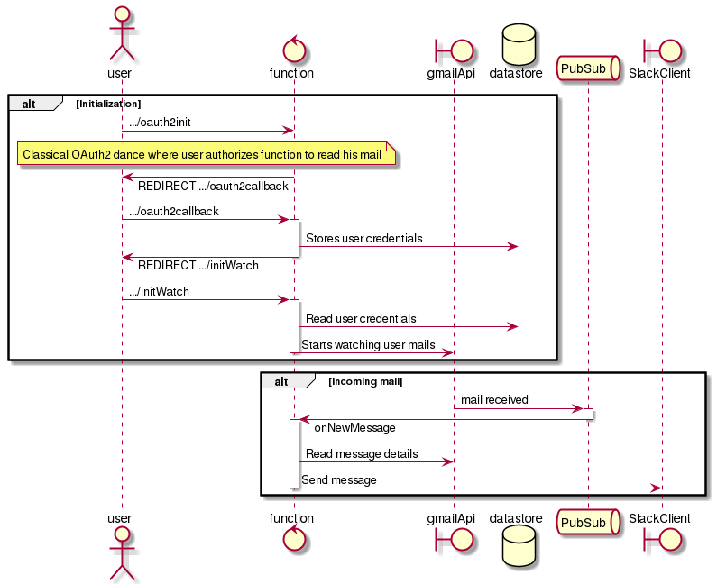

<h1 align="center">Welcome to lilaobot 👋</h1>

  
  

> lilaobot allows call for offers from various sources (currently OBMS and Little Big Connection are envisionned) to be gathered from sources and to be published into Slack channel

Work in progress :construction:

## Setup
### Deployment
On each commit, Github Action (`.github/workflows/main.yml`) applies Terraform conf (located at `./terraform`),
to deploy the GCP Functions (located at `./functions`)

Terraform state is saved in a Google Cloud Storage named `lilaobot-terraform-state`

### Requirements
- a GCS bucket to store Terraform's state
- a GCP Service Account, with following roles:
    - `Cloud Function Developer`
    - `Service Account User`
    - `Storage Object Admin`
    - `Storage Admin`
- Secrets on Github repository:
    - GCP_SA_KEY (service account credentials, a JSON file)
    - GCP_PROJECT (project id)
- Create an OAuth Client ID Credentials through GCP Console -> APIS & Services -> Credentials
- Secrets on GCP through GCP Console -> Security -> Secret Manager:
    - oauth2-client-id: Client ID from previously created OAuth Credentials
    - oauth2-client-secret: Client ID from previously created OAuth Credentials
    - slack-bot-token: The token of the Slackbot Application (https://api.slack.com/authentication/basics)

## Resources
This project is based on [this article from Google](https://cloud.google.com/blog/products/application-development/adding-custom-intelligence-to-gmail-with-serverless-on-gcp), without the image part.

Below, the goal of this actual project:

## How to Use

After deployment you can activate the bot through this URLs : https://europe-west1-lilaobot.cloudfunctions.net/oauth2init

**BEWARE** This will send all your new mails into Zenika Slack channel named [`project-lilaobot`](https://zenika.slack.com/archives/C021BGBSMFY)

**NOTE** This URLs is retrievable in the GCP Console -> Cloud Functions -> Trigger -> HTTP.

Once this url is invoked (and authorization is granted) the function is authorized to read user mails.

## How does it works ?

Two main flows are visible here: initialization and transfer of message

## Author

👤 **Logan Hauspie**

* Twitter: [@lhauspie](https://twitter.com/lhauspie)
* Github: [@lhauspie](https://github.com/lhauspie)

## 🤝 Contributing

Contributions, issues and feature requests are welcome! Feel free to check [issues page](https://github.com/Zenika/lilaobot/issues). 

## Show your support

Give a ⭐️ if this project helped you!

***
_This README was generated with ❤️ by [readme-md-generator](https://github.com/kefranabg/readme-md-generator)_